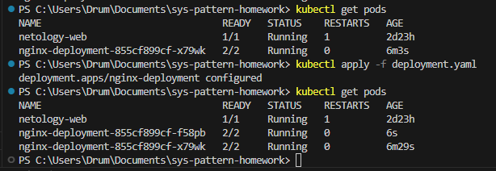
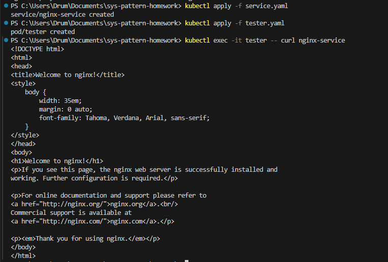
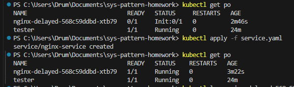

# Домашнее задание к занятию "`Запуск приложений в K8S`" - `Дромашко Кирилл Сергеевич`

---

### Задание 1. Создать Deployment и обеспечить доступ к репликам приложения из другого Pod

1. Создать Deployment приложения, состоящего из двух контейнеров — nginx и multitool. Решить возникшую ошибку.
2. После запуска увеличить количество реплик работающего приложения до 2.
3. Продемонстрировать количество подов до и после масштабирования.
4. Создать Service, который обеспечит доступ до реплик приложений из п.1.
5. Создать отдельный Pod с приложением multitool и убедиться с помощью curl, что из пода есть доступ до приложений из п.1.

#### Создаем Deployment

```yaml
apiVersion: apps/v1
kind: Deployment
metadata:
  name: nginx-deployment
  labels:
    app: nginx
spec:
  replicas: 2
  selector:
    matchLabels:
      app: nginx
  template:
    metadata:
      labels:
        app: nginx
    spec:
      containers:
      - name: nginx
        image: nginx:1.14.2
        ports:
        - containerPort: 80
      - name: multitool
        image: wbitt/network-multitool
        command: ["/bin/sh", "-c", "sleep infinity"]
```


#### Создаем Service

```yaml
apiVersion: v1
kind: Service
metadata:
  name: nginx-service
spec:
  selector:
    app: nginx
  ports:
    - protocol: TCP
      port: 80
      targetPort: 80
```
#### Создаем Pod для тестирования

```yaml
apiVersion: v1
kind: Pod
metadata:
  name: tester
spec:
  containers:
  - name: multitool
    image: wbitt/network-multitool
    command: ["/bin/sh", "-c", "sleep infinity"]
```


---

### Задание 2. Создать Deployment и обеспечить старт основного контейнера при выполнении услови

1. Создать Deployment приложения nginx и обеспечить старт контейнера только после того, как будет запущен сервис этого приложения.
2. Убедиться, что nginx не стартует. В качестве Init-контейнера взять busybox.
3. Создать и запустить Service. Убедиться, что Init запустился.
4. Продемонстрировать состояние пода до и после запуска сервиса.

#### Создаем Deployment с Init-контейнером

```yaml
apiVersion: apps/v1
kind: Deployment
metadata:
  name: nginx-delayed
spec:
  replicas: 1
  selector:
    matchLabels:
      app: nginx
  template:
    metadata:
      labels:
        app: nginx
    spec:
      initContainers:
      - name: wait-for-service
        image: busybox:1.28
        command: ['sh', '-c', 'until nslookup nginx-service; do echo waiting for service; sleep 2; done;']
      containers:
      - name: nginx
        image: nginx:1.25.3
        ports:
        - containerPort: 80
```

#### Создаем Service

```yaml
apiVersion: v1
kind: Service
metadata:
  name: nginx-service
spec:
  selector:
    app: nginx
  ports:
    - protocol: TCP
      port: 80
      targetPort: 80
```



---