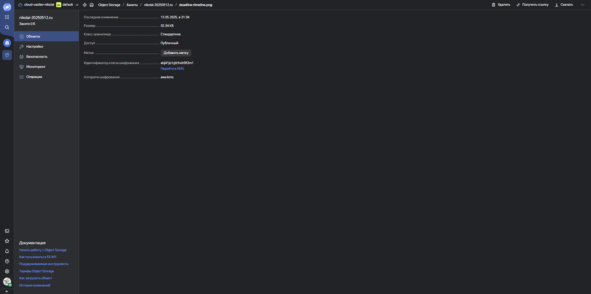
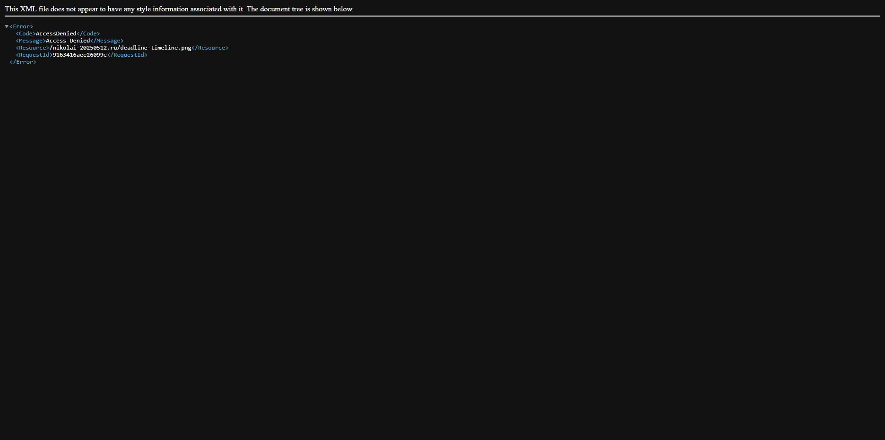
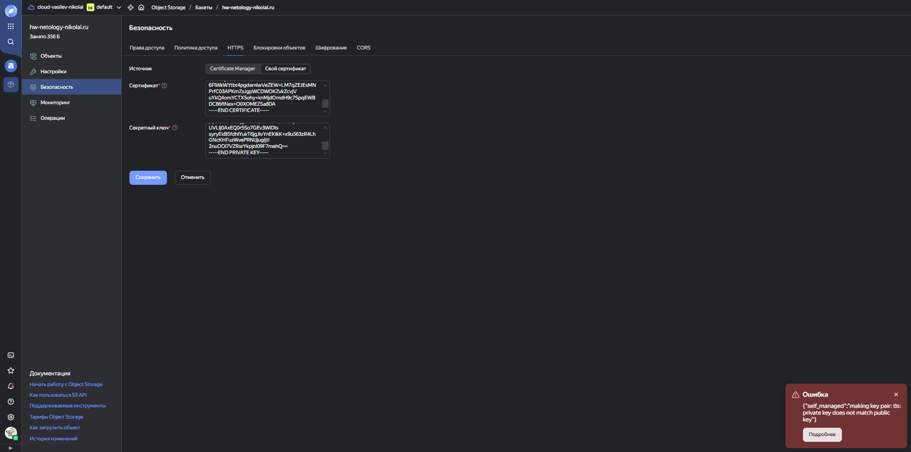
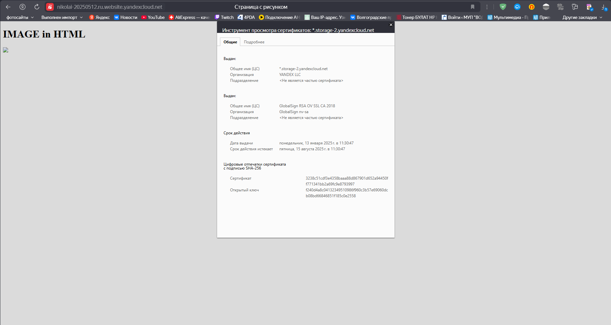
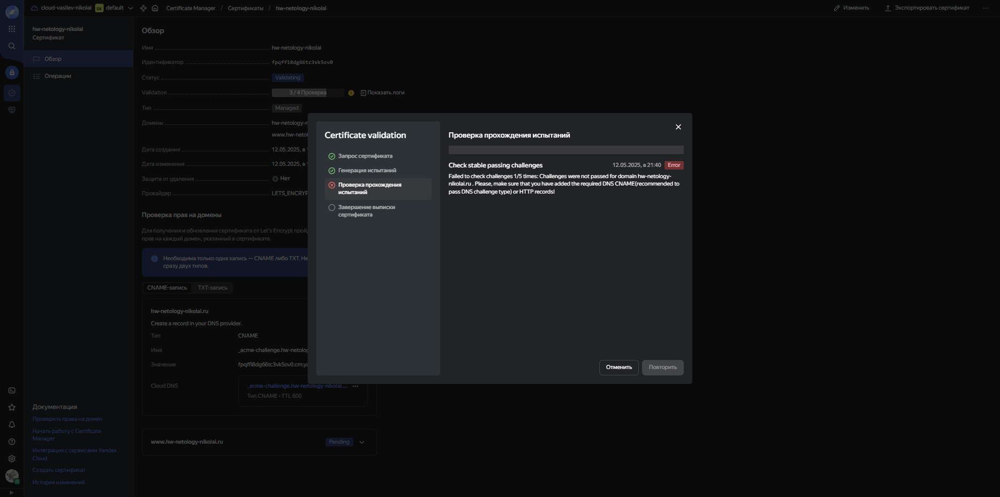
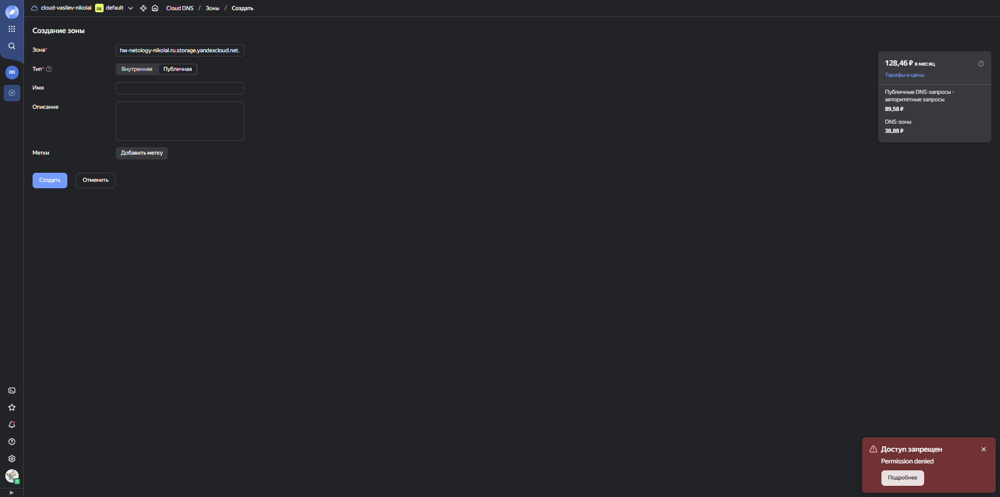

# Домашнее задание к занятию `«Безопасность в облачных провайдерах»` - `Васильев Николай`

Используя конфигурации, выполненные в рамках предыдущих домашних заданий, нужно добавить возможность шифрования бакета.

---
## Задание 1. Yandex Cloud   

1. С помощью ключа в KMS необходимо зашифровать содержимое бакета:

 - создать ключ в KMS;
 - с помощью ключа зашифровать содержимое бакета, созданного ранее.
> 
> 
> ### [Crypt_bucket](../img/hw_15.3/main.tf)

2. (Выполняется не в Terraform)* Создать статический сайт в Object Storage c собственным публичным адресом и сделать доступным по HTTPS:

 - создать сертификат;
 - создать статическую страницу в Object Storage и применить сертификат HTTPS;
 - в качестве результата предоставить скриншот на страницу с сертификатом в заголовке (замочек).
> Не получается выпустить сертификат от Let's Encrypt. Что я только не пытался сделать.
> 
> Это получение по HTTP. Удалось пройти процедуру проверки LE, но когда вставляю public, private, пишет что не совпадает сертификат с приватным.

> 
> Это у меня получилось прикрепить, сертификат по ID через terraform, но крепит что-то непонятное, видимо из-за ".website.yandexcloud.net", но без него никак, ибо по другому доступа к бакету получить не удается.

> 
> Тут я пытаюсь получить сертификат через DNS, создал CNAME для проверки LE, дальше не идет процесс. TXT то же самое.

> 
> Тут почти то же самое, при получении с помощью DNS с использованием ".website.yandexcloud.net", при создании CNAME и TXT для проверки ошибка, недостаточно прав.
> ### [Terraform](../img/hw_15.3)
Полезные документы:

- [Настройка HTTPS статичного сайта](https://cloud.yandex.ru/docs/storage/operations/hosting/certificate).
- [Object Storage bucket](https://registry.terraform.io/providers/yandex-cloud/yandex/latest/docs/resources/storage_bucket).
- [KMS key](https://registry.terraform.io/providers/yandex-cloud/yandex/latest/docs/resources/kms_symmetric_key).